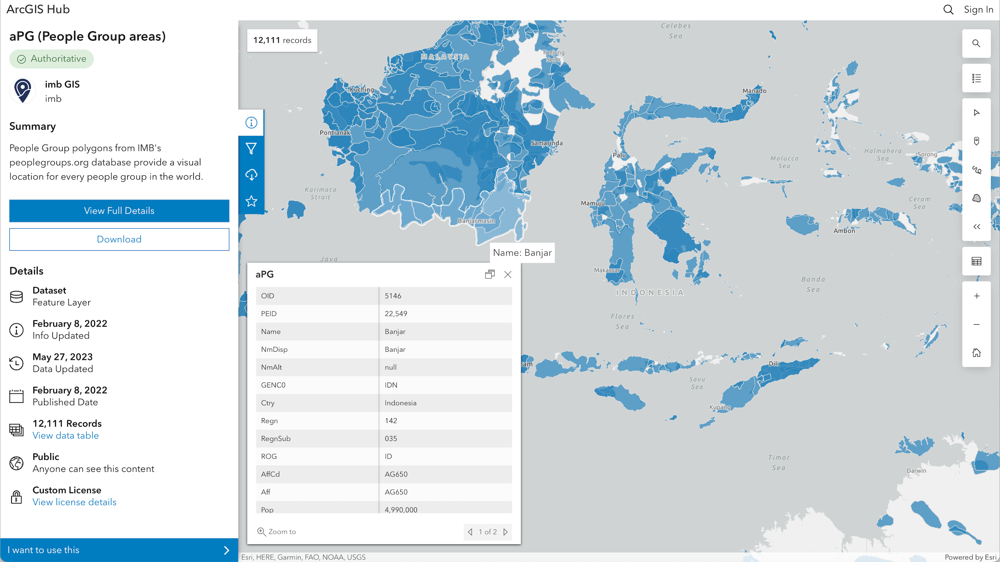

---
jupytext:
  formats: md:myst
  text_representation:
    extension: .md
    format_name: myst
    format_version: 0.13
    jupytext_version: 1.11.5
kernelspec:
  display_name: Python 3
  language: python
  name: python3
---

# Example: PeopleGroups

[People Groups](https://www.peoplegroups.org) is a global organization dedicated to spreading the Christianity to people all over the world. In their mission, they have collected a vast amount of data about the locations of communities of "people groups" in countries and territories all over the world.

Below are screenshots showing some of the characteristics of the data collected about people groups.

As part of this project, a GitHub repository with an Jupyter notebook used to process and carry out the method can be found at [this link](https://github.com/andrewjoc/ihs/tree/main/people_groups_validation). In depth instructions to download Python and use the notebook can be found at [this link](https://docs.google.com/document/d/1xqXKISHkB7hqz_Rl3fIUXK5OCHp5MGhb0uJ7Z-sMH5I/edit).
