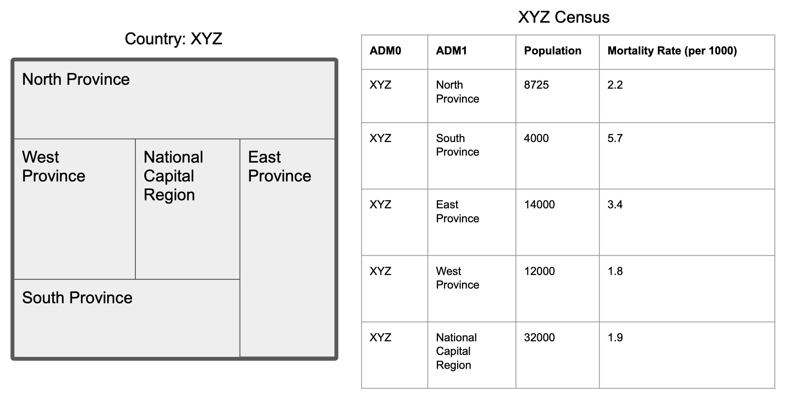
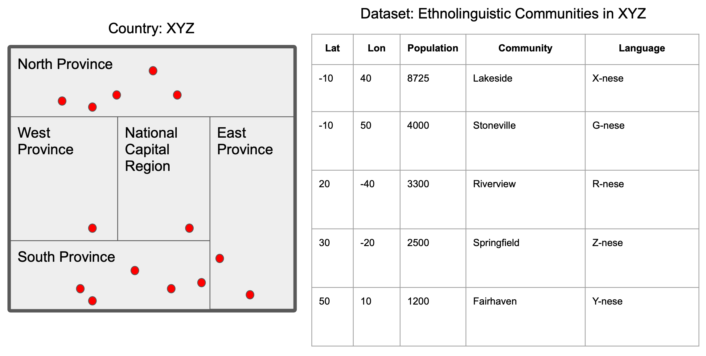
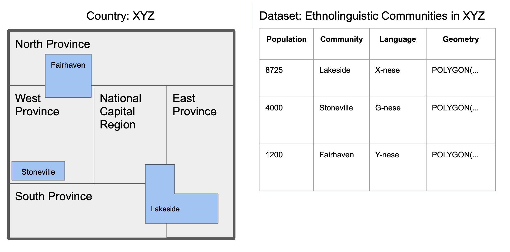

# Methodology

In this section, a fictional example is provided to illustrate the proposed methodology for validation. The main premise of the method is to determine if a population coming from a data source of unknown quality is plausible by comparing it to the most granular official population data at the smallest available subnational level.

## Subnational Level Comparison

Suppose a dataset exists containing the locations of communities along with basic aggregate statistics (e.g. population, median income, birth rate, death rate, dependency ratio). The dataset comes from a source in which the data are not well documented. Is the population of each commmunity plausible? 

Below are the some of the results of the most recent census for the fictional country "XYZ". This country has 5 first level administrative divisions (ADM1) and is further broken down into provinces (ADM2), districts (ADM3) and census units (ADM4). 

A dataset from the web containing the locations of ethnolingusitic communities is found, each with a recorded population. A sample of the dataset is shown below, along with a map of red markers which indicate the locations of each group in relation to the country boundaries.

Since the validty of the data source is unknown and official subnational populations exist (provided by the XYZ census), we can attempt to address the main question by comparing the population of (i) each individual community and (i) the sum of all communities to the official census estimates. From here, we can to classify a community population as 'valid' if the community has a population less than or equal to the boundary population, allowing an error of up to 5%.

This method can be extended to geospatial data that may include polygons. In that case, a spatial join can be performed and aggregation can be done by the smallest subnational level, potentially resulting in a list of subnational boundaries in which an ethnolinguistic group is located within. In this case, the population of the ethnolinguistic group can be compared to the sum of the population of all subnational boundaries. 

